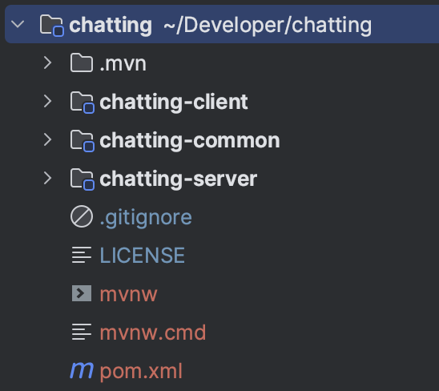
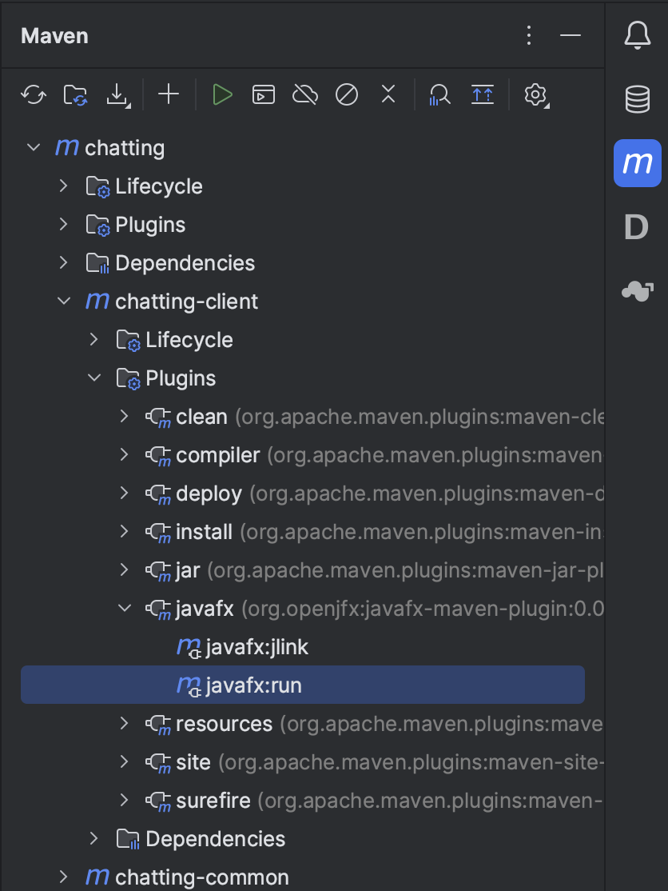

# 🫧 Chatting


**Chatting** is a simple online-chat application, based on JavaFX and Socket.
In this assignment, you will need to implement a WeChat like program, but much simpler.

## Quickstart

Click the [use template](https://github.com/hezean/chatting/generate) to create a fork of this template - to avoid potential plagiarism dispute,
**please be sure that your repository is made _private_ before the deadline**.

> We also provide you a template with `lombok` that makes your code shorter and more elegant.
> To use that, make sure you've checked the **Include all branches** option when creating your fork.
> Then merge the `lombok` branch into `main`.
> 
> **You must submit all your code to the `main` branch.**

You need to then clone your fork into local machine. You can then open the whole folder as a project in your
IDE - it will recognize the Maven structure and automatically configure the project.



### Install the Project

We will define the commonly used constants and models in the `chatting-common` model,
which is the dependency of `chatting-client` and `chatting-server`.

> This design is a common practice in many large projects.
> But it is not mandatory for you to follow this architecture.
> You can move the model codes to other places if you want.

The first thing you need to do is to install the parent pom into the local maven repository.

```shell
mvn install
```

Note that each time after you modified the codes in `chatting-common`, you need to reinstall
the subproject -- you can think about why.

```shell
mvn install -pl chatting-common
```

### Run the Server

As our client will try to connect to the server socket when starting-up, you need to run the server before starting
one or more clients.

Please find the `Main` class under the `chatting-server` model, implement your `ServerSocket`,
and run the `main` method.

### Run the Client

If you are using JDK 1.8 with JavaFX bundled, you may find the `Main` class under the `chatting-client` model,
and run the `main` method to start a client.
Note that you can start multiple clients by clicking the _run_ button several times.

If you are using JDK in any higher version, please use the `javafx` plugin to run the client.
```shell
mvn javafx:run -pl chatting-client
```

Alternatively, you can find the goal in the plugin list, and click on it:


## Tasks

- [ ] Server & Client (70 pt)
- [ ] JavaFX GUI (15 pt)
- [ ] Exception handling (15 pt)
- [ ] Bonus (12 pt)

For more details, please refer to the [assignment description](DESCRIPTION.md).

## Hint

As this project is Maven managed, it's easy to introduce _dependencies_ and _build plugins_.
This template already added some dependencies that may help you finish this assignment,
you can search their documents and try figuring out how these dependencies could be helpful, but it's not
necessary to use them. You may also introduce some other dependencies, but ask the teacher or SA before doing so.

## More Information

If there's anything ambiguous about the document or the instruction above,
feel free to [open an issue](https://github.com/hezean/chatting/issues/new) and ask.
Your question may also help others to better understand this assignment 🔥

## License

This project is licensed under the MIT License - see the [LICENSE](LICENSE) file for details.
